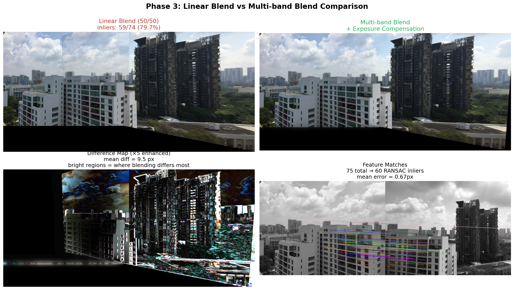
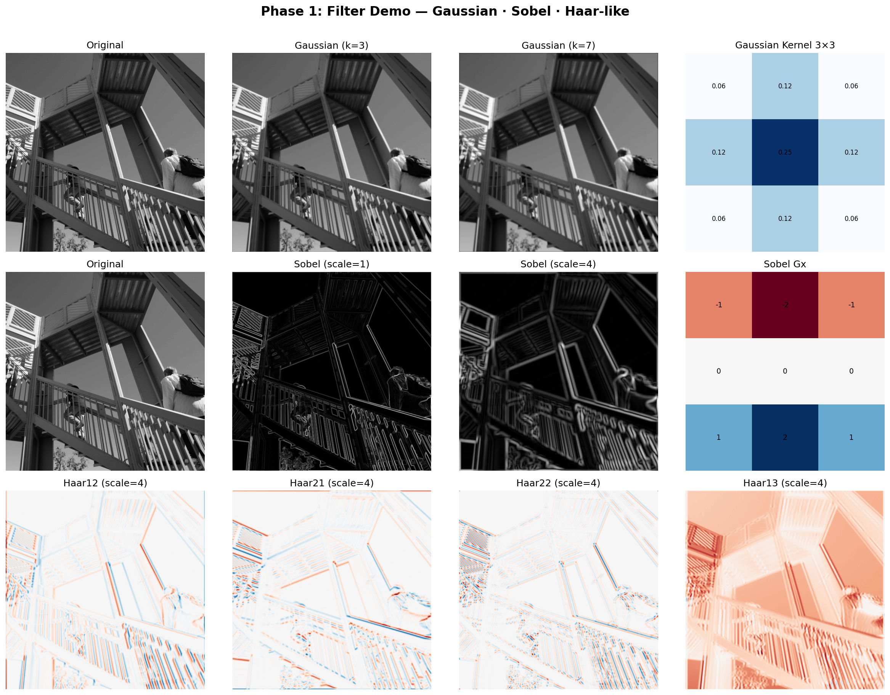
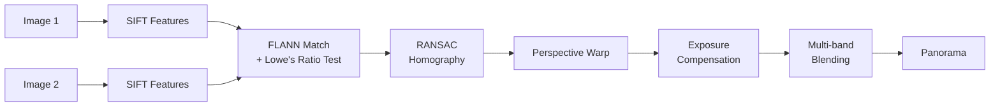

# Panoramic Image Stitching (Python)

[](https://www.python.org/)
[](LICENSE)
[](https://opencv.org/)

基于 SIFT 特征和 RANSAC 算法的全景图像拼接系统。全流程 Python 重写自 [YICHENG-LAI/Panoramic-Image-Stitching](https://github.com/YICHENG-LAI/Panoramic-Image-Stitching)（MATLAB 版本，MIT 协议），并加入了多频段融合、曝光补偿和特征提取器对比实验。

## Demo

### 两图自动拼接 + 融合对比



*左上：线性 50/50 混合（原 MATLAB 行为） | 右上：多频段融合 + 曝光补偿 | 左下：差异放大图 | 右下：特征匹配*

### 滤波器可视化



## Pipeline



## 相比原 MATLAB 版本的改进

| 模块 | 原 MATLAB | 本实现 |
|------|----------|--------|
| 语言 | MATLAB | Python (OpenCV + NumPy) |
| SIFT 提取 | 外部 C 可执行文件 | `cv2.SIFT_create()` |
| 特征匹配 | 简单最近邻 | FLANN + Lowe's ratio test + 双向验证 |
| 单应性估计 | 裸 DLT | Hartley 归一化 DLT |
| RANSAC | 固定 3000 次迭代 | 自适应迭代 + 提前收敛 |
| 图像融合 | 50/50 逐像素平均 | **拉普拉斯金字塔多频段融合** |
| 曝光处理 | 无 | **自动增益补偿** |
| 卷积核缩放 | 双重循环 | `np.kron` 单行向量化 |
| 色彩处理 | 必须先 `rgb2gray` | 自动转换，RGB/灰度通用 |

## 快速开始

```bash
# 1. 安装依赖
pip install -r requirements.txt

# 2. 下载测试图片
python download_test_images.py

# 3. 运行演示
python demo.py --mode filters     # 滤波器可视化
python demo.py --mode stitch      # 两图自动拼接
python demo.py --mode compare     # 线性 vs 多频段对比
```

## 项目结构

```
panorama-stitching-python/
├── src/
│   ├── filters.py        # 卷积核：Gaussian / Sobel / Haar-like
│   ├── features.py       # SIFT 特征提取 + FLANN 匹配
│   ├── homography.py     # DLT 单应性矩阵（Hartley 归一化）
│   ├── ransac.py         # 自适应 RANSAC
│   ├── stitcher.py       # 拼接 Pipeline
│   ├── blending.py       # 拉普拉斯金字塔多频段融合
│   └── exposure.py       # 自动曝光补偿
├── notebooks/
│   ├── 01_filters_demo.ipynb    # 滤波器交互式演示
│   └── 02_sift_vs_orb.ipynb     # SIFT vs ORB 对比实验
├── data/                        # 测试图片（运行 download_test_images.py 获取）
├── demo.py                      # 统一演示入口
├── demo_filters.py
├── demo_stitch.py
├── demo_blend_compare.py
└── requirements.txt
```

## SIFT vs ORB 对比实验

| 指标 | SIFT | ORB |
|------|------|-----|
| 关键点数 | ~1600 | ~500 |
| 匹配对数 | ~75 | ~30 |
| inlier 率 | ~80% | ~60% |
| 平均误差 | <1px | ~2px |
| 速度 | 较慢 | **快 5~10×** |
| 尺度不变 | ✅ | ❌（需图像金字塔） |
| 旋转不变 | ✅ | ✅ |

详见 `notebooks/02_sift_vs_orb.ipynb`

## 致谢

本项目基于 [YICHENG-LAI/Panoramic-Image-Stitching](https://github.com/YICHENG-LAI/Panoramic-Image-Stitching)（MIT License）重写和改进。

参考论文：
- Lowe, D. G. (2004). *Distinctive Image Features from Scale-Invariant Keypoints*. IJCV.
- Burt, P. J. & Adelson, E. H. (1983). *A Multiresolution Spline With Application to Image Mosaics*. ACM TOG.
- Brown, M. & Lowe, D. G. (2007). *Automatic Panoramic Image Stitching using Invariant Features*. IJCV.

## License

MIT © 2024
